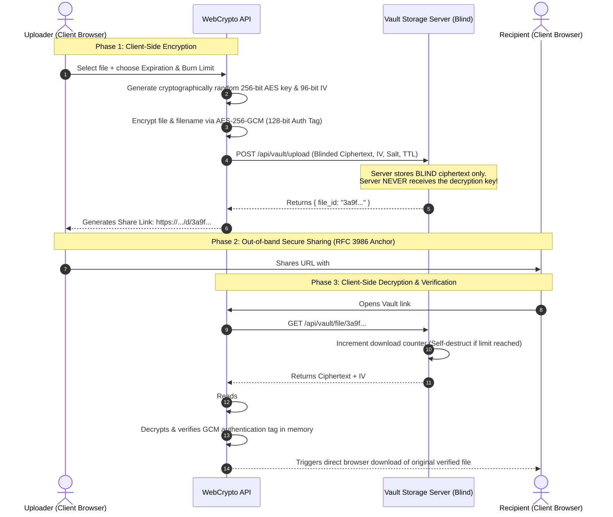

# 🛡️ ZeroVault: Zero-Knowledge Secure File Vault

[](LICENSE)
[](https://python.org)
[](https://csrc.nist.gov/publications/detail/sp/800-38d/final)
[](#-cryptographic-architecture--threat-model)
[](#-automated-testing)

An enterprise-grade, **Zero-Knowledge End-to-End Encrypted (E2EE)** ephemeral file storage and secure sharing platform. Files are encrypted client-side inside the browser using the **WebCrypto API** before transmission. The server operates as a **blind storage engine**—it never sees, handles, or stores plaintext files or decryption keys.

---

## 🔒 Cryptographic Architecture & Threat Model



---

## 🌟 Key Security Features

1. **Client-Side Authenticated Encryption (AES-256-GCM)**:
   - Uses the native browser `window.crypto.subtle` API.
   - Every file is encrypted with a unique 256-bit key and 96-bit Initialization Vector (IV).
   - The 128-bit Galois authentication tag guarantees data integrity and detects any Man-In-The-Middle (MITM) tampering or bit-flipping.

2. **RFC 3986 URL Hash Key Isolation**:
   - The decryption key is embedded in the URL fragment (`#key=...`).
   - Per RFC 3986, URL fragments are parsed **exclusively** on the client and are **never** transmitted across the wire in HTTP request headers.

3. **Passphrase-Derived Key Mode (PBKDF2-HMAC-SHA256)**:
   - Option to protect links with a personal passphrase.
   - Derives keys using 100,000 rounds of PBKDF2 with a 128-bit cryptographically random salt per file.

4. **Burn-After-Reading & Self-Destruction**:
   - Single-use downloads: files are securely shredded from disk immediately upon first retrieval.
   - Configurable Time-To-Live (TTL): 10 minutes, 1 hour, 24 hours, or 7 days.

5. **Cryptographic Data Shredding**:
   - Before unlinking expired or burned files from disk, the server overwrites the storage blocks with random entropy (`secrets.token_bytes`) to thwart filesystem block recovery.

6. **Zero External Dependencies Required**:
   - Ships with an asynchronous, multi-threaded standard library server (`http.server.ThreadingHTTPServer`), meaning it can be run immediately on any system with Python 3.10+ without running `pip install`!
   - Also includes a full FastAPI ASGI application (`backend/asgi_app.py`) for enterprise container deployments.

---

## 🛡️ Threat Model & Guarantees

| Attack Scenario | Vault Protection Mechanism | Outcome |
| :--- | :--- | :--- |
| **Complete Server Compromise** | Server only holds blinded ciphertext blobs; never receives keys or passphrases. | **No Plaintext Leakage**: Attacker cannot decrypt any stored files without client-side keys. |
| **Network Eavesdropping / ISP Interception** | Key is anchored in the URL hash (`#`); HTTPS protects transport. | **Key Protected**: URL hash fragments are never sent across HTTP request lines. |
| **Payload Tampering / Bit-flipping** | AES-GCM 128-bit authentication tag validation. | **Detected & Blocked**: WebCrypto rejects modified ciphertext with cryptographic verification failure. |
| **Server Cold-Disk Recovery** | Secure random overwriting (`secrets.token_bytes`) prior to unlinking. | **Unrecoverable**: Data blocks cannot be reconstructed from raw storage drives. |

---

## 🚀 Quick Start

### 1. Run Locally (Zero Dependencies!)
Run directly using Python's built-in runtime:

```bash
# Clone the repository
git clone https://github.com/f20250305-ship-it/zk-file-vault.git
cd zk-file-vault

# Start the Vault
python run_vault.py
```

Your browser will automatically open to:
```
http://localhost:8080
```

---

## 📡 REST API Reference

### `POST /api/vault/upload`
Uploads a client-encrypted ciphertext blob.
- **Request Body (JSON)**:
  ```json
  {
    "ciphertext": "<base64_encoded_ciphertext>",
    "iv": "<base64_encoded_12_byte_iv>",
    "salt": "<base64_encoded_16_byte_salt>",
    "encrypted_filename": "<base64_encoded_filename_meta>",
    "expires_in": 86400,
    "max_downloads": 1
  }
  ```
- **Response (201 Created)**:
  ```json
  {
    "success": true,
    "file_id": "8f3a9e1b4c7d0e2f5a6b8c9d0e1f2a3b",
    "expires_at": 1789504800.0,
    "max_downloads": 1,
    "is_burn_after_reading": true
  }
  ```

### `GET /api/vault/file/{file_id}`
Retrieves ciphertext and increments download counter (triggers burn if threshold reached).

### `GET /api/vault/meta/{file_id}`
Non-destructive metadata inspection (does NOT consume download count).

### `GET /api/vault/stats`
Telemetry regarding active encrypted blobs and total purged/shredded files.

---

## 🧪 Automated Testing

Run the included automated cryptographic and storage unit tests:

```bash
python -m unittest tests/test_vault_api.py
```

---

## 📄 License
Released under the [MIT License](LICENSE). Built for high-assurance cybersecurity and privacy research.
